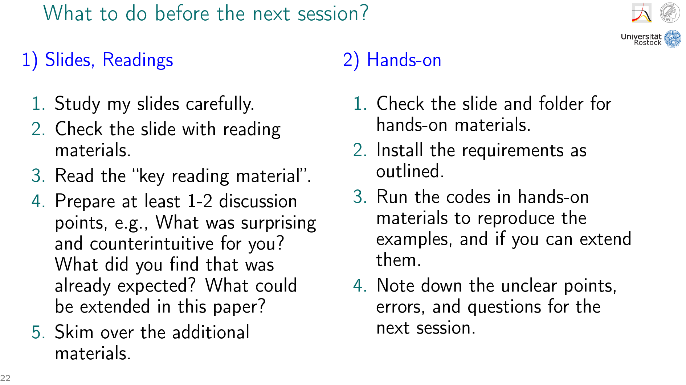

# Hands-on materials

Please check slides for each topic to find the name of the lab file and data that are going to be used, and requirements slide for the packages to install.

## A list of resources, books, online materials, R, Python packages, Excel, etc. for demographic methods

The initial list that was shared here is now grown into a much longer list, thanks to the help by other colleagues, and is now hosted at Open Science Demography: [https://github.com/OpenScienceDemography/awesome-demographic-methods](https://github.com/OpenScienceDemography/awesome-demographic-methods).

Please refer to that list to find many materials that can help you while learning demographic methods, how they can be implemented using different software tools, and for preparing your final essay.

# What to do before the next session?

