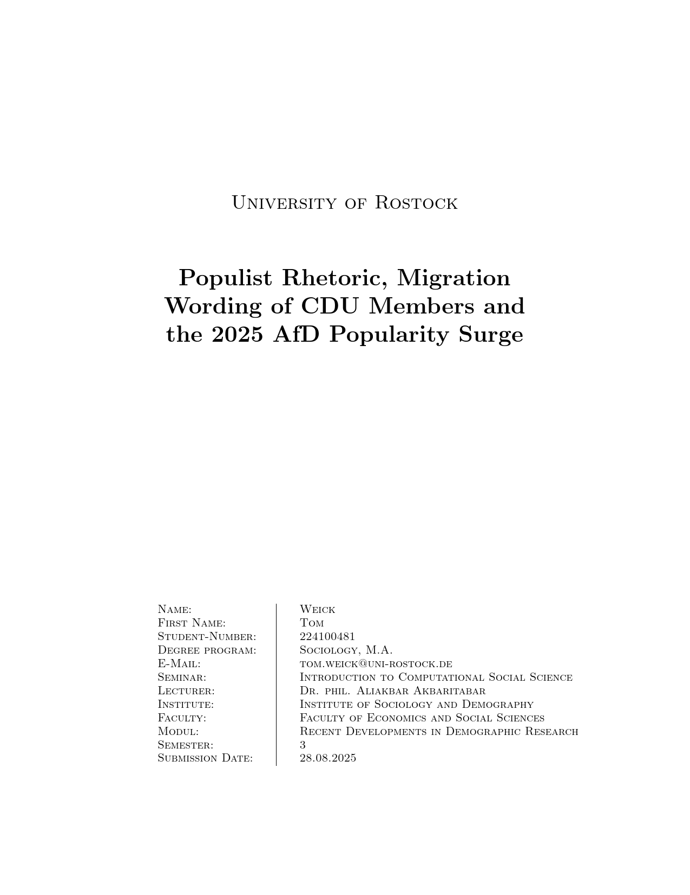
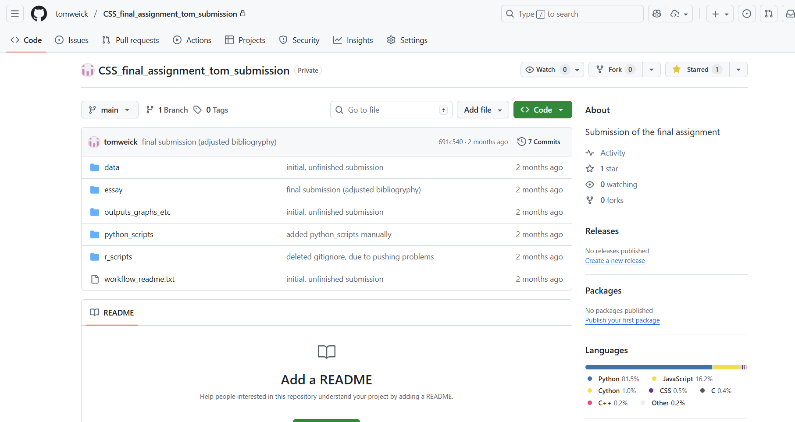

# An example of a student's final assignment and materials for the examination

In this folder, I have included a PDF which is the final essay of Tom Weick for my 2025 summer semester course on "Introduction to Computational Social Science".

A photo of his GitHub repository where the replication materials for the course's final assignment including scripts, data, plain text of the paper and its compiled PDF.

This is shared with Tom's consent to allow you to have an example of how the essay and repository of replication materials could be like.

**Example final essay from Tom Weick**

**Example student repository for final assignment from Tom Weick**

